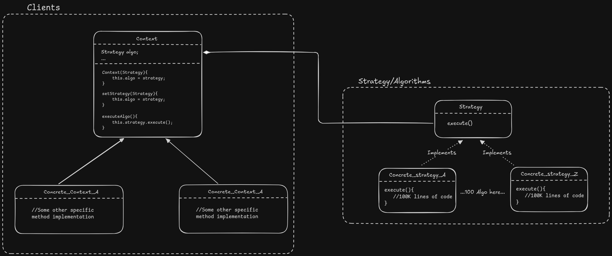

## Problem:
1. There will be multiple functionalities that needs to be switch on basis of conditions.
2. There will be functionalities and conditions to choose one from them, also conditions and functionality may increase in future.
3. Functionalities tends to achieve the result for the same thing but in different ways.
4. These functionalities are reuable, meaning we may require the same Algorithm somewhere else too.

## What are the ways to implement this:

### `If-Else` Conditional handeling for switching between different Algorithm
```
function doSomething(var wayToDoThing){
    if(wayToDoThing == "A"){
        // Some Algorithm
    }    
    else if(wayToDoThing == "B"){
        // Some Algorithm
    }
    ....
    else if(wayToDoThing == ".."){
        // Some Algorithm
    }
}
```
**Why it is not a Good idea:**
1. As the Algorithms increases in future we will require Code changes + testing of same code Again + Some other Logic may break as we add new code in same method.
2. Large If-Else ladder hard to navigate and understand the code
3. Lets say if we want to process the data by multiple Algorithms and then return the best result then it will cause unneessary repetation of Code.

**We are not Following**
1. SRP
2. OCP


### Defining Various Algorithm in seperate method of the same class and calling methods in `If-Else` ladder
Slight improvement over previous way, But still,
1. Class level SRP is not followed
2. OCP is not followed

### Inheritance Way
In this approach, you create a base class with common behavior and extend it to create different subclasses for each specific algorithm.

1. For example there is the base class with the default implementation of the functionality and there will be different segregation of the sub-class extending the main class. Here each sub-class will either have their own implementation or using the default one.

```
class BaseProcessor {
    process() {
        // Default implementation
    }
}

class ProcessorTypeA extends BaseProcessor {
    process() {
       // Algorithm A Implementation
    }
}

class ProcessorTypeB extends BaseProcessor {
    process() {
       // Algorithm B Implementation
    }
}

BaseProcessor processor = new ProcessorTypeA();
processor.process();
```
**Why it is not a Good idea:**

1. Let's say we have same functionality applicable to multiple different types, But other than algorithm there are few things different in those type -> That why they are 2 seperate types.
2. Now the thing is we need to have the redundant code in those type with same algorithm
3. Also future changes may become inconsistent at some time. Or we need to implicitly take care of changing it everywhere.
4. Now if some day we decide to change algorithm for some sub-type then we need to rewrite the code again for it.

**We are not Following**
1. DRY
2. OCP
3. Loose Coupling of code.

## Clean Approach by Strategy pattern
### **Composition Over Inheritance**

1. We keep Algorithm's seperate from the Subtype using them.
2. Algorithms are flexible to Add new, Switch between, and making choice among them within the Process (Sub-type) dynamically.

https://excalidraw.com/#json=t2N5z9OfCpAPxtaREsz7N,v7RwGKSSSOy8W3FfSoupDg



### Why it is Clean and Optimal approach to implement
1. We are Reusing the Algorithm Code
2. Switching algorithm dynamically within the same client object.
3. Seperation of Concern (SRP)
4. If we want to add new Algo we just need to implement the strategy interface. No Existing Code is affected (OCP)

