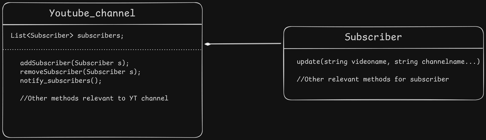
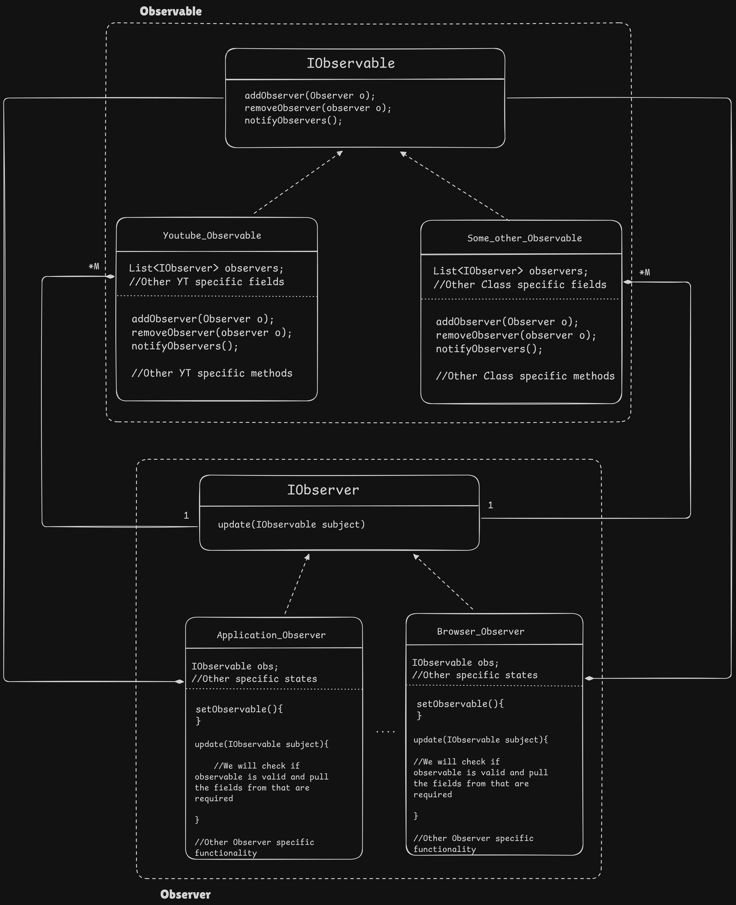

# Observers Design Pattern

1. Whenever change in the State/Variable of Object happens, it should auto-trigger/call the method performing some action.

**Example:** 
- If there is a `Youtube_channel` class, and each individual channel is Object of this class.
- There is a `subscriber` class and each subscriber is the object of this subscriber class.
- Now whenever the `Youtube_channel` is updated with the new Youtube Activity(Video, Post, etc) then each subscriber has to be notified.

## How can we implement this:

### Nieve Appoach -- Subscribers Polling for changes

Basically Subscribers will have a function `Poll_updates` and this will have a infinite loop running where it will ask for the update every **millisecond/Time-defined**

#### Why it is not a good idea
1. The number of `Subscriber` objects will increase rapidly and it all of them poll for changes continuously they will overwhelm  the `Youtube_channel`
2. To make the Polling from Subscriber & other functionalities to run simultaneously we need to have multithreading approach, Each Subscriber will need separate thread.
3. What if the `subscriber` need to subscribe more Youtube_channel, There will be lot of work.

### Better Approach -- Youtube_channel pushing notification to the subscriber.

1. We have `Youtube_channel` class and `Subscriber` class
2. Now `Youtube_channel` will have list of `Subscriber` objects.
3. Whenever new changes introduce to `Youtube_channel` object all its associated Subscribers will get notified.

#### Why it is not a good idea
1. Tight Coupling between Youtube channel and Subscriber. 
2. If youtube_channel needs to notify any gmail_subscriber then it will not work as it is hard coded to subscriber
3. Subscriber has rigid update method, There will be multiple types of subscriber like (All notification update, Only videos, videos & reels, etc).

#### We are not Following
1. OCP (Open Closed Principle)
2. DIP (Dependency Inversion Principle)

## There Should be an `Observable/Subject` and an `Observer` Interface

### In Observer Design pattern their are two ways to implement
1. Push based Update: Observable calls the `updade()` of all the observers with all the params that observable have.
    This lead to sometime providing the extra info to the observer when it is not needed.
2. Pull based Update: Here the Observable calls the `update()` but it gives the functionality with Observer to choose what they want from Observable
    Observers basically Pull the info relevant to them via Observable's `getter()`

#### Why it is good way to implement:
1. We have loosely Coupled Design
2. If we want a new type of subscriber we can add new Observer class without changing existing ones (OCP)
3. Each Implementation is dependent on Interface (DIP)

