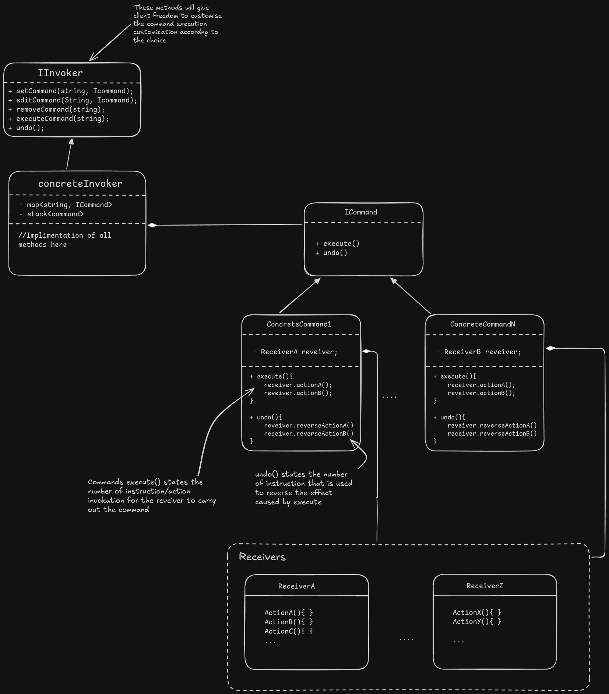

# Command Design Pattern

## The Scenario:

Assume you are building the **menu/actions** functionality for a tool like a Text Editor/IDE (VS Code, IntelliJ, Google Docs) or an Image/Video Editor.
1. **Core Actions:** The application has numerous **commands** (Copy, Save, Format) that modify the file's data.
2. **Multiple Triggers:** The *same* command can be executed in multiple ways: clicking a toolbar button, pressing a keyboard shortcut (e.g., `Ctrl+C`), or using the right-click context menu.
3. **History Management:** The system must support **Undo** (reverting recent changes) and **Redo** (re-applying them) multiple times.

## Approaching the solution

### Naive Approach:

### 1. Single Class (Centralized Logic)
We create a single class, often called `Menu` or `EditorActions`, that contains the logic for **every** supported feature in the application.
* If we want to **Bold** text, we add a `boldText()` method.
* If we want to **Save**, we add a `saveFile()` method.
* If we want to **Print**, we add a `print()` method.

### 2. Invocation & Mapping
Since we have multiple triggers for the same action (Toolbar Button, Keyboard Shortcut `Ctrl+B`, Right-Click Menu), we maintain a **global map** or a giant `switch-case` statement.
* This map links a "Trigger ID" (like `BUTTON_BOLD`) to a specific method in the `Menu` class.
* When a user clicks a button, the UI simply looks up which method to call.

### 3. The "Opposite Action" Undo Strategy
To handle **Undo/Redo**, we rely on a stateless map of "opposites."
* We maintain a lookup table: `BOLD` -> `UNBOLD`.
* We keep a simple **Stack of Strings** (Action IDs).
* When the user hits `Ctrl+Z`, we pop the last action ID (`BOLD`), look up its opposite (`UNBOLD`), and execute that method.

## Implementation with command design pattern

> **Definition:**
> The Command design pattern encapsulates the request as an object, letting you parameterize other objects with different requests, **Queue** or **Log request** and support undoable operations.

- **Receiver:** The class that knows how to perform some particular action to produce the results. `It is like a Bulb which knows how to glow and how to turn off`
- **Commands:** Receiver's request are encapsulated in the concrete command class. Like we can use the command to instruct Receiver. `It is just command which tells receiver what function to do`
- **Invoker:** This is where we can customize how we can invoke the command. Like when I say something what command I am trying to execute. `It is like a Remote which stores the key-command mapping`

### Now why all this is required:
1. If we want generic Undo, Redo functionality. We can achieve because we have some command-objects that we can remember.
2. Basically we can have records/memory of the command we have, and also the record of executed commands history. All this is **Loosely coupled** manner

### SOLID
- Code is extensible we can add/remove commands without violating **OCP**
- We have each Command class a handling single command, Receiver knows only its own functionality, Invoker just manage the mapping and execution of the commands. Following **SRP**.
- **LSP & ISP:** We have each interface and class seamlessly substituting the parent.
- **DIP:** Every class is dependent on Interface, just excluding the receivers as receivers can have different functionality so cannot generalise it.

### Without Command as a object
1. How would you remember commands. To perform some remembering operations on command like Queue, log, undo, redo, Will it follow SOLID?
2. How about customization of command to instruction mappings?