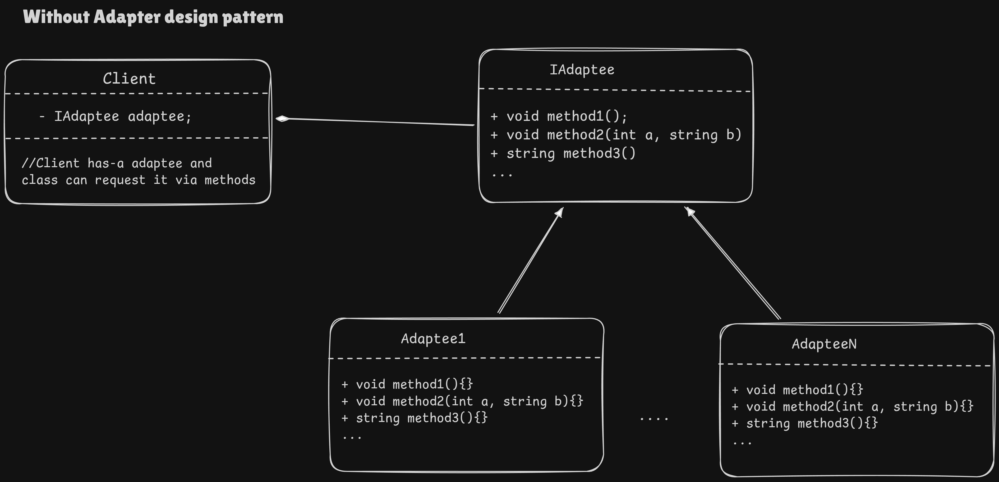
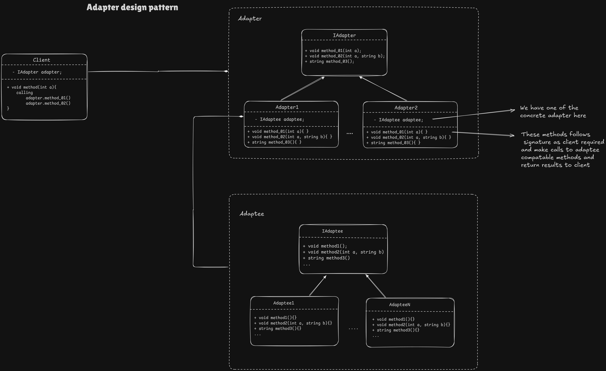

# Adapter Design Pattern

1. **Assume the scenario where**
   * We have an Indian AC power outlet generally of 3 round pins
   * We have a US style AC power plug
   * To make this plug compatible with the power outlet we use adapter. 
   * Same is the work of **OO adapter** in Adapter-Design-Pattern

2. **OO scenario**
   * Over the time we have designed multiple classes in our code that were dependent on an interface. And we have a lot of **well tested code** dependent on that interface.
   * Now requirements change, and we need our existing code to depend on some another interface having similar functionality but with different method signatures.
     * Maybe we want to switch dependency from one vendor to another
     * Maybe some additional functionality has to be added in the interface and for that some function param's type or even count of params changes.
   * Now in order to switch from one interface to another we need to take care that our existing code does not break.
   * As the code is well tested over the time, just to switch the underlying interface providing almost same functionality should not cause the re-testing each and every component that was using the interface, again.

## We can design the similar adapter class as we have adapters in real world.
1. Each time we need to switch from one interface to another providing almost same functionality we do not need to make changes in our underlying code that is previously dependent on some other interface.
2. Reduces unnecessary bandwidth required to test the same code each time, as we are not modifying the code we are just adding the compatible adapter in between.
3. Switching from one interface to another becomes seamless if we have compatible adapter class for each class.

## Adapter Pattern Components and UML

1. **Client**: Client is our code which was dependent on some target interface. Now it is dependent on target via adapter interface
2. **Adapter**: Adapter's work is to provide interface compatible with client and conversion of client request to the compatible adaptee request.
3. **Adaptee**: Client request is actually resolved by adaptee(made compatible with adapter or even a direct request) and returns back the response.

> **Note:**
> * `IAdaptee` in the **1st diagram** is consider as a **Target** i.e. the interface our client directly talks to, and get their request's response directly.
> * In 2nd diagram still the **Target Interface** is `IAdaptee`. That means we will get our request resolved from this class itself. 
>   * But the thing is it is not compatible with our code assumptions, so we make an IAdapter that is compatible to the interface definition we have assumed in our entire code, and acts as a target for us. 
>   * This `IAdapter`'s class (The assumed Target) then convert the request format to actual target format, and then we get our desired response from there.

### We are Following SOLID
1. **Open close Principle**: Each time we switch different target interface we do not change the well tested client code, rather we write new compatible adapter. 
2. **Dependency Inversion Principle**: We are not dependent on the concrete adapter in client rather we are dependent on Adapter interface. And same with adapter and adaptee.
3. **Single responsibility Principle**: Subjective here as client & target/adaptee defines what other things it is doing. But our adapter follows SRP.
4. **Liskov substitution Principle**: All child class are able to substitute parent class seamlessly as of now.
5. **Interface Segregation Principle**: No class is forced to implement method they do not need.