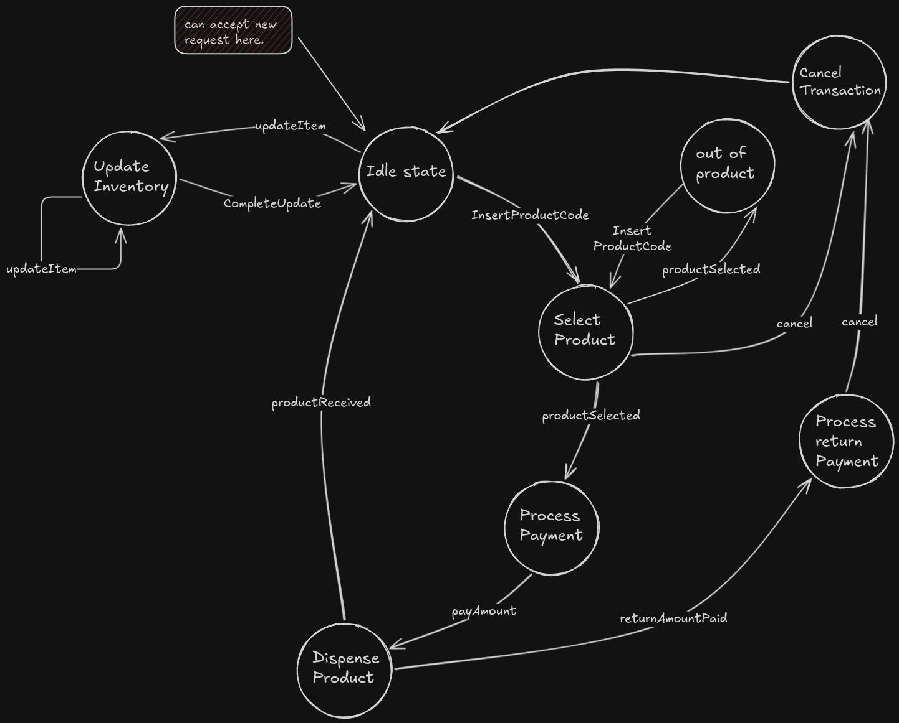
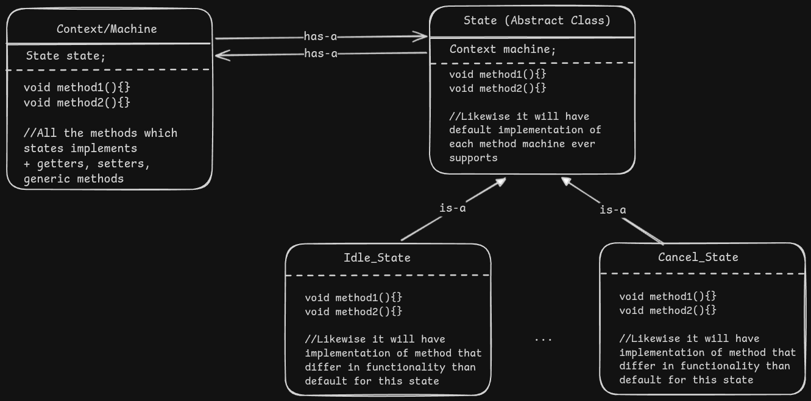

# State Design Pattern

- Whenever we want the behavior of same object to act differently, dependent of what state of operational flow it is currently in.
- Assume that the object can go into different states when we perform some actions on it.
- And in each state the object should behave accordingly, means the same actions call might vary when object in different state.

## Assume we are building the Vending machine like setup


### What are the core functionality of such vending machine
**It should allow user to:**
1. Insert product code to select product they want.
2. Proceed for payment
3. Process payment for the product.
4. Dispense the requested product.
5. Cancel the partial transaction, get refund if paid already.
6. After user receive the product the vending machine can accept the new requests.

**What if?**
1. Someone pay amount without giving product details.
2. Someone request new product during ongoing request processing (payment processing, dispense processing, etc).
3. Someone asks for refund of money after product is dispensed.
4. Someone ask for the product not available



## Arriving to the solutions

1. In the above diagram the actions denoted by Arrow are the actions that user request to machine.
2. Its machine responsibility to allow user to perform only valid actions (valid for that state), and through appropriate errors for inappropriate action. (Like someone cannot ask refund after order is dispensed).
3. Now user is unaware of this states of the machine. User don't care about knowing at what state machine is.
4. They only want a valid actions to give valid response.
5. And Machine reliability depends on throwing errors if some action is done in unexpected order, (Breaking the flow of requests).

### Naive Approach

1. User do not care about states they just call actions.
2. We as a machine designer want to know states to make actions work appropriately

- In `VendingMachine` class we will store & change the state of the machine, internally for further program's knowledge.
- Each action user will perform is a public method of machine class, that user can call.
- For each state we will define the behavior of that action in that method.

```java
public class VendingMachine {

    // 1. Define all states internally
    public enum State {
        IDLE, 
        UPDATE_INVENTORY, 
        SELECT_PRODUCT, 
        OUT_OF_PRODUCT, 
        ...
        
        // Inventory map here
    }
    // Constructors, getters and setters

    // --- Public Actions (User can call) ---
    public void insertProductCode() {
        switch (currentState) {
            case IDLE:
            case SELECT_PRODUCT: // Self-loop shown in diagram
                System.out.println("You can insert product code now...");
                currentState = State.SELECT_PRODUCT;
                break;
            default:
                System.out.println("Cannot insert product code right now.");
        }
    }

    public void productSelected(int productCode) {
        bool isAvailable // -> check if this product is available in inventory.
        if (currentState == State.SELECT_PRODUCT) {
            if (isAvailable) {
                System.out.println("Product available. Moving to payment.");
                currentState = State.PROCESS_PAYMENT;
            } else {
                System.out.println("Out of stock.");
                currentState = State.OUT_OF_PRODUCT;
            }
        } else {
            System.out.println("Please insert a product code first.");
        }
    }
    
    public void cancel(){
        if(currentState == State.SELECT_PRODUCT || currentState == State.SELECT_PRODUCT || State.PROCESS_PAYMENT){
            System.out.println("Cancellation in progress";
            currentState = State.CANCEL_TRANSACTION;
        }else if(currentState == State.IDLE){
            // For each and every state basically we will have some customizable error.
        }
    }
}
```

#### Why it is not the good idea?
1. In future if we want to add some new states to the machine (ex: along with direct payments machine can accept the token coins to dispense product. Maybe these tokens are prepaid or given by employer to all the employees)
2. In such cases where new states can introduce, we need to change entire logic of the machine.
3. Changes at multiple places in the code.
4. Inconsistency may occur if we forgot to make change somewhere.

#### We are not following:
1. **SRP**: Machine class is holding all the responsibility
2. **OCP**: Small change needs the modification in entire vending machine
3. **ISP**, **LSP**: No interface, just one God class.
4. **DIP**: Only single God class.


### Better Approach : State Design Pattern

1. Each **state** represented by the Circle in the above diagram is considered as a separate class.
2. Each **transition** (i.e. Action user call for) represented by the Arrow in above diagram, will be methods in each **state class**.
3. These **transition** methods in the **state** class will decide the behavior of that action in that particular state. Meaning the behavior of `productSelected()`, `cancel()` varies in each state. 
4. Now the vending machine will know which state it is in currently, by storing the state object in it.
5. And for each action/method requested by user to vending machine. The machine delegates it to the **state** object.



#### Why it is better than previous?
- If we want to add new states then we will just inherit the State class and create new state.
- Changes in the existing states will be limited to those states that are related to new state.
- We do not need to take care of multiple combinations of the states as in the previous approach. Just dependent state level local code change
- Defining the default behaviour in parent **State** class will reduce redundancy of the code.


#### We are following:
1. SRP: Each concrete state implement the functionality of action for itself. 
2. OCP: till some extent, better than prev approach
3. LSP, ISP: States are generalized in parent **State** class
4. DIP: Each has-a relationship is between Higher level classes.
